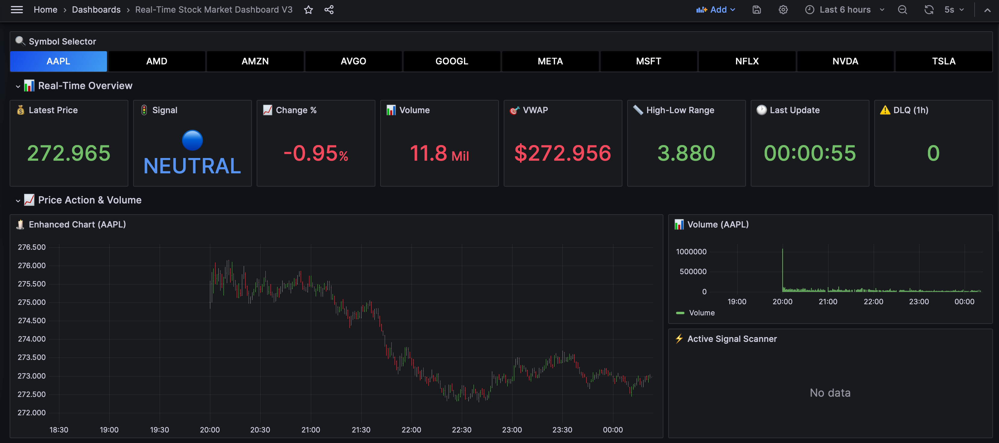
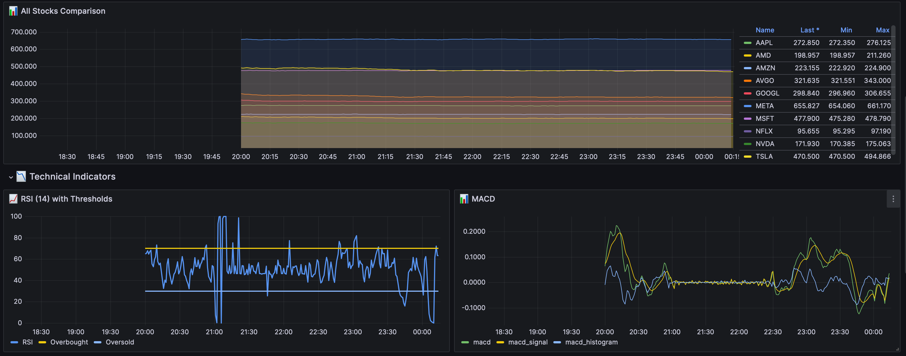
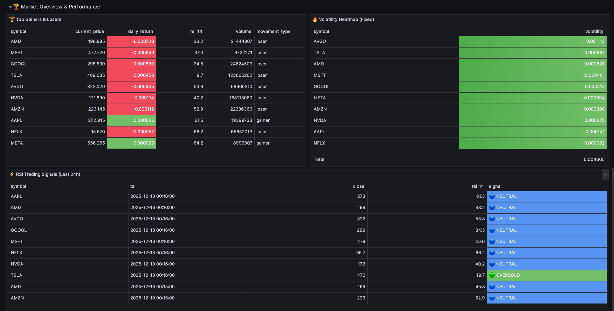
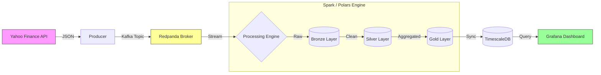

# 🚀 Real-Time US Stock ETL Platform


A production-grade, high-latency streaming data pipeline designed to ingest, process, and visualize US stock market data in real-time. This project demonstrates advanced data engineering patterns including **Medallion Architecture**, **idempotent writes**, **ACID transactions**, and **dead-letter queue (DLQ) handling**.

---

## 📸 Dashboard Preview

### 1. Market Overview

*Real-time ticker tape, price movements, and volume heatmaps.*

### 2. Technical Analysis

*Live MACD, RSI, and Bollinger Band trend analysis.*

### 3. Volatility Heatmap

*Real-time visualization of price volatility and market intensity.*

---

## 🎯 Project Overview

This platform continuously streams 1-minute OHLCV (Open, High, Low, Close, Volume) data for top US mega-cap stocks. It processes this data through a multi-stage pipeline to compute sophisticated technical indicators and provides sub-second dashboards for trading analytics.

**Key Capabilities:**
-   **Data Ingestion**: Fetches real-time market data from **Yahoo Finance**.
-   **Dual-Engine Processing**: 
    -   **Spark Streaming**: For scalable, distributed generic processing (Bronze/Silver/Gold layers).
    -   **Polars ETL**: A lightweight, high-performance alternative for single-node efficiency.
-   **Observability**: Integrated **Loki & Promtail** stack for centralized container log monitoring.
-   **Reliability**: Robust error handling with persistent state management and automatic retries.

> [!IMPORTANT]
> **Data Source Credit**: This project utilizes the **Yahoo Finance API** for financial market data. Logic is implemented in `producer/producer.py` to fetch highly granular 1-minute interval data. All data usage complies with educational and non-commercial purposes.

---

## 🏗️ Architecture

### High-Level Data Flow



### Medallion Architecture
The pipeline follows the industry-standard Medallion design pattern:

1.  **🥉 Bronze Layer (Raw)**: 
    -   Ingests raw JSON data directly from Redpanda/Kafka.
    -   Append-only storage in **Delta Lake**.
    -   Schema evolution supported.

2.  **🥈 Silver Layer (Cleaned)**:
    -   Performs deduplication and data quality checks (e.g., non-negative prices).
    -   Enforces strict schema validation.
    -   Uses `MERGE` operations to ensure **idempotency**.

3.  **🥇 Gold Layer (Curated)**:
    -   Computes business-level aggregates and technical indicators.
    -   Optimized for read-heavy analytical queries.

---

## 📦 Technology Stack - Deep Dive

We use a modern, cloud-agnostic stack designed for scale and reliability.

| Component | Technology | Version | Description & Role |
|-----------|------------|---------|--------------------|
| **Streaming Engine** | **Apache Spark** | 3.4.1 | Distributed data processing engine. Handles micro-batch stream processing for Bronze, Silver, and Gold layers. ensures exactly-once semantics via structured streaming. |
| **Alt. Engine** | **Polars** | Latest | High-performance DataFrame library used for the "Lightweight Mode" (`COMPOSE_PROFILES=polars`). Runs on a single node with extremely low memory footprint. |
| **Orchestration** | **Apache Airflow** | 2.x | Manages workflow scheduling. Handles producer monitoring, backfills, quality checks, and daily maintenance tasks. |
| **Message Broker** | **Redpanda** | 23.3.3 | C++ implementation of Kafka. Removes Zookeeper dependency and provides 10x lower latency. Buffers partial data between Producer and Spark. |
| **Storage Format** | **Delta Lake** | 2.4.0 | Open-source storage layer that brings ACID transactions (Time Travel, Schema Enforcement) to Apache Spark and big data workloads. |
| **Operational DB** | **TimescaleDB** | PG-15 | PostgreSQL extension for time-series. Stores the final "Gold" data for sub-millisecond query performance in Grafana. |
| **Visualization** | **Grafana** | 10.2.3 | The observability platform. Connects to TimescaleDB for metrics and Loki for logs. |
| **Containerization** | **Docker** | 24+ | Fully containerized environment using Docker Compose for infrastructure-as-code deployment. |

---

## ⚙️ Configuration & Environment Variables

The system is fully configurable via the `.env` file. Below are the key tunable parameters:

### Core Configuration
| Variable | Default Value | Description |
|----------|---------------|-------------|
| `COMPOSE_PROFILES` | `spark` | **[Critical]** Switches between `spark` (Distributed) and `polars` (Lightweight) ETL modes. |
| `STOCK_TICKERS` | `AAPL,MSFT,...` | Comma-separated list of stock symbols to track. |
| `PRODUCER_INTERVAL_SECONDS` | `60` | Frequency (in seconds) that the producer fetches new data ticks. |
| `FORCE_BACKFILL` | `false` | If `true`, wipes all data and performs a historical backfill on startup. **Use with caution.** |

### Infrastructure
| Variable | Description |
|----------|-------------|
| `REDPANDA_BROKER` | Address of the Kafka broker (default: `redpanda:9092`). |
| `SPARK_WORKER_CORES` | Number of cores allocated to Spark Workers. |
| `SPARK_WORKER_MEMORY` | RAM allocated to Spark Workers (e.g., `2g`). |
| `TZ` | Container Timezone (e.g., `America/New_York`). |

---

## 🌪️ Airflow Orchestration & DAGs

Airflow is the nervous system of the platform, ensuring reliability and data integrity.

### 1. `stock_producer` (Every Minute)
-   **Checks Market Hours**: Skips execution if NYSE is closed (weekends/holidays).
-   **Health Check**: Verifies the producer container is running and healthy.
-   **Verifies Logs**: Peeks at recent logs to ensure no critical errors.

### 2. `stock_monitoring` (Every 5 Minutes)
-   **Producer Heartbeat**:Alerts if no new data has been fetched in the last 10 minutes.
-   **DLQ Monitor**: Checks the Dead Letter Queue topic. Triggers an alert if failure count > 10.
-   **Data Freshness**: Queries Delta Tables to ensure Spark is actually writing data.

### 3. `service_sentinel` (Self-Healing)
-   **Watchdog**: Inspects Docker container states for all critical services (Redpanda, Spark, Timescale).
-   **Auto-Remediation**: Automatically **restarts** any container found in `unhealthy` or `exited` state.

### 4. `stock_backfill` (Manual Trigger)
-   **Gap Detection**: Analyzes state files to find missing time ranges.
-   **Historical Fetch**: Pulls up to 7 days of 1-minute granular data from Yahoo Finance to plug gaps.

### 5. `stock_quality_check` (Daily)
-   **Schema Validation**: Ensures all Bronze/Silver tables match the strict schema.
-   **Completeness**: Verifies all tickers are present in the day's dataset.
-   **Outlier Detection**: Flags any price movements > 10% in a single minute (potential data error).

### 6. `gold_rebuild` (Daily Maintenance)
-   **Full Recompute**: Optional DAG to drop and recreate the Gold layer from the Silver source of truth (useful for evolving KPI logic).

---

## ⚡ Key Features & Functionality

### 1. Robust Data Ingestion
-   **Smart Backfill**: Automatically detects gaps in data (e.g., after system downtime) and fetches historical data to fill the void up to 365 days.
-   **Rate Limiting**: Intelligent polite sleeping between requests to respect API limits.
-   **Deep Validation**: Cross-verifies intraday ticks against daily adjusted close prices to ensure data accuracy.

### 2. Advanced Technical Analysis
The Gold layer automatically computes a rich set of financial indicators:
-   **Trend**: SMA (5, 20, 50), EMA (9, 21), MACD (12/26/9).
-   **Momentum**: RSI (14-period) with overbought/oversold detection.
-   **Volatility**: ATR (14-period), Bollinger Bands (20, 2).
-   **Volume**: VWAP (Volume Weighted Average Price).
-   **Market Phase**: Classification (Bullish, Bearish, Consolidation/Accumulation) based on EMA cross-overs.

---

## 🚀 Quick Start

### Prerequisites
-   Docker Desktop (Allocated: 4 CPU, 8GB RAM minimum)
-   Git

### Installation & Run

1.  **Clone the Repository**
    ```bash
    git clone https://github.com/your-username/realtime-us-stock-etl-platform.git
    cd realtime-us-stock-etl-platform
    ```

2.  **Configure Environment**
    ```bash
    cp .env.example .env
    # The default configuration works out-of-the-box.
    ```

3.  **Launch Services**
    ```bash
    docker compose up -d
    ```

4.  **Access Interfaces**
    -   📊 **Grafana**: [http://localhost:6010](http://localhost:6010) (admin/admin)
    -   🌪️ **Airflow**: [http://localhost:6009](http://localhost:6009) (admin/admin)
    -   🐼 **Redpanda Console**: [http://localhost:6003](http://localhost:6003)
    -   💥 **Spark Master**: [http://localhost:6004](http://localhost:6004)

---

## 📈 Monitoring Logs (Loki & Promtail)

We implement the **PLG Stack** (Promtail, Loki, Grafana) for seamless log aggregation. You never need to SSH into containers.

1.  Open **Grafana** ([http://localhost:6010](http://localhost:6010)).
2.  Navigate to **Explore** (Compass icon on the left).
3.  Select **Loki** from the datasource dropdown.
4.  **Useful Queries**:
    -   **Show Producer Logs**: `{container_name="stock-producer"}`
    -   **Show Spark Errors**: `{job="docker"} |= "error"`
    -   **Live Stream**: Click the "Live" button in Grafana to see logs stream in real-time.

---

## 🤝 Contributing

Contributions are welcome! Please fork the repository and submit a Pull Request.  
For major changes, please open an issue first to discuss what you would like to change.

---

**Built with 🧡 for the Data Engineering Community.**
